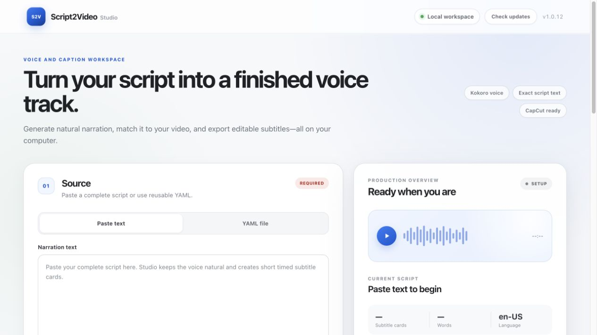

# script2video

[English](README.md) | [简体中文](README.zh-CN.md)

Turn pasted text or YAML scripts into local Kokoro narration, readable timed
subtitles, and files you can import into CapCut. Supported deployments are the
**Windows desktop application** and the **Docker browser application**.



## Docker

Install Docker Engine with Compose, or Docker Desktop, and start Docker.
Clone this repository, then run from its directory:

```bash
mkdir -p data/input data/output
docker compose up --build -d
```

Open **http://127.0.0.1:8765**. The first image build downloads Python and speech
libraries and may take several minutes. The first voice generation downloads
Kokoro model files. These are reused through the persistent `model-cache` volume.
The image uses CPU inference and runs as a non-root user.

- Paste your script directly into Studio for narration and subtitles.
- For YAML or video inputs, put files in `data/input` on your computer, then enter
  their container paths, such as `/data/input/script.yaml` or `/data/input/video.mp4`.
- Keep the output workspace at `/data/output`. Each generation appears in its own
  dated folder under `data/output` on your computer.
- Play the full narration under **Your files**, then download the WAV, SRT, or
  original script directly in your browser. **Preview first sentence** is only
  a short voice audition.
- Import the generated WAV and SRT into CapCut on your computer.

The input mount is read-only. Desktop file dialogs, folder launching, and CapCut
launching are hidden in Docker. The service is published only on localhost and
retains Studio's host/origin checks and session-token protection. Keep port 8765
unchanged on both sides of the mapping; arbitrary hostnames and remote hosting
are not configured by this Compose file. Stop any source-launched Studio using
that port before starting the container.

Useful commands:

```bash
docker compose logs -f studio
docker compose down
docker compose up --build -d
```

`docker compose down` preserves model downloads and your input/output folders.
Do not add `--volumes` unless you intend to delete the model cache.
On Linux, the output folder must be writable by container UID 1000. If your
account uses another UID, set the output folder ownership appropriately before
starting Studio; do not use world-writable permissions.

## Windows desktop

Download the Windows x64 installer from
[GitHub Releases](https://github.com/saslifat-gif/script2video/releases).
It opens Studio in a native window. Paste text, choose a language and voice, and
select **Generate Narration**. Add a video to build a timed CapCut package.

The first generation downloads the speech model. The installed application saves
output under `Documents/Script2Video Studio` by default. Every generation gets a
separate folder. Windows builds include Japanese and Chinese pronunciation tools.

To run Windows from source with Python 3.11:

```powershell
py -3.11 -m venv .venv
.\.venv\Scripts\python.exe -m pip install --upgrade pip
.\.venv\Scripts\python.exe -m pip install ".[kokoro]"
.\.venv\Scripts\script2video.exe companion
```

Install FFmpeg if using video inputs:

```powershell
winget install --exact --id Gyan.FFmpeg
```

If a voice reports a missing eSpeak library, install eSpeak NG from its
[official releases](https://github.com/espeak-ng/espeak-ng/releases).
Do not open `web_static/index.html` directly: Studio must serve the interface
through its local server so styling, voice selection, and generation work.

## Narration and subtitle timing

Choose sentence, paragraph, line-break, or whole-script scenes. Readable caption
cards are synthesized as measured audio segments. Caption boundaries exclude
leading and trailing near-silence, with a small margin for quiet speech. The audio
itself, internal pauses, and scene positions stay unchanged.

Windows and Docker use measured segment timing without an additional alignment
model. The generic Python alignment interface remains available to integrations;
unreliable timestamps fall back to measured segments with a warning.

When a video is selected, narration speed is fitted within 0.50–2.00. If it cannot
match the video within three attempts, files are saved and Studio warns you to
review timing. Warnings are also recorded in `manifest.json`. Regenerate existing
exports to apply subtitle-timing improvements.

## Outputs

```text
output/<generation>/
├── narration.wav
├── captions.srt
├── manifest.json
├── metadata/source.txt      # pasted-text workflow
└── scenes/
    └── 001-*.wav
```

In CapCut, import `narration.wav` and import `captions.srt` through the caption
import interface, both starting at timeline time zero. Studio produces standard
files and does not modify CapCut project files or render a finished video.

## YAML and command line

```yaml
title: Demo
language: en-US
engine: kokoro
voice: af_heart
scenes:
  - id: intro
    text: Welcome. This script becomes locally generated narration.
    pause_after_ms: 500
  - id: explanation
    text: Each scene is recorded in the manifest.
    speed: 1.0
```

```bash
script2video validate examples/demo.yaml
script2video voices --engine kokoro
script2video render examples/demo.yaml --output builds/demo
script2video capcut examples/demo.yaml --video input.mp4 --output builds/package
```

Use `--no-fit` to preserve scene speeds. The legacy `--no-align` flag is accepted
for compatibility; built-in generation uses measured caption timing.
The `render-srt` command converts subtitle text into narration scenes; it does not
promise to preserve the source SRT's absolute timestamps.

Supported languages: `en-US`, `en-GB`, `es-ES`, `fr-FR`, `hi-IN`, `it-IT`, `ja-JP`,
`pt-BR`, and `zh-CN`. Choose a voice matching the script's language.

## Development

Install `.[dev,kokoro]` into a Python 3.11 environment, then run:

```bash
python -m pytest
node --test tests/studio-ui.test.cjs
```

Tests use a deterministic fake voice engine and require no speech-model download.
For a quick command-line smoke test:

```bash
script2video render examples/demo.yaml --engine fake --voice test_narrator --output builds/demo-fake
```

The Docker build and smoke-test workflow checks both the API and fake narration
exports. Real speech additionally requires the model download to complete.

- [Windows packaging](docs/windows-packaging.md)
- [CapCut package design](docs/m3-capcut.md)
- [License](LICENSE)
