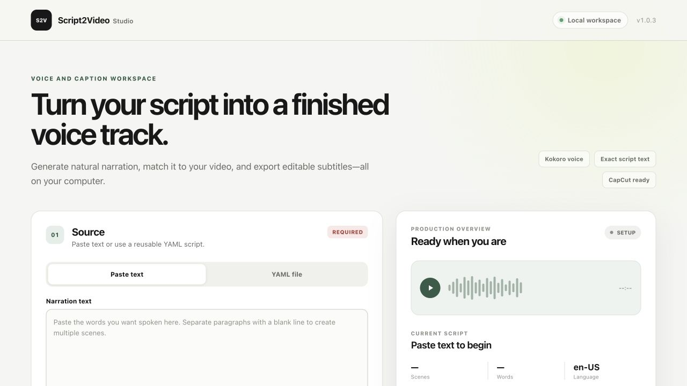
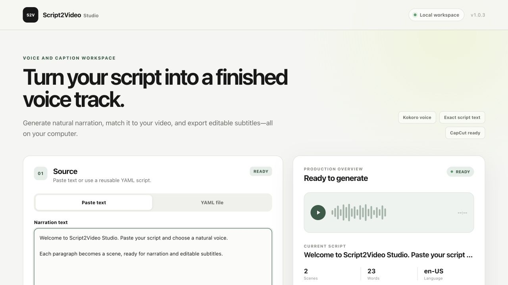

# script2video

[English](README.md) | [简体中文](README.zh-CN.md)

Local-first tools for turning a complete pasted script or structured YAML into
narration, sentence-level scenes, timed captions, and an editable CapCut package.

`script2video` runs speech generation and alignment on your machine. It can
render narration scene by scene, fit the result to an existing video, and
produce standard WAV, SRT, and JSON files without modifying CapCut project
files.

> **Status:** Ready for local use on macOS and Windows. Narration generation
> does not require a video. Add a video only when you want a timed CapCut
> package with captions.

> **Version 1.0.3:** The Windows application now opens Studio inside its own
> desktop window, checks for updates, and fixes voice selection and output-folder
> opening in Paste text mode. Blank-line paragraphs automatically become scenes.

> **Version 1.0.4 hotfix:** Restores the language registry required by Kokoro
> inside the packaged Windows application. This fixes the
> `language_tags/data/json/index.json` error seen when generating narration in
> v1.0.3.

> **Version 1.0.6:** Corrects the plain-text workflow. Paste one complete script
> and choose Sentence, Paragraph, Line break, or Whole script scene splitting.
> Studio generates the continuous voice track and an SRT timed to the speech.

## Studio preview



The workspace keeps the script, narration settings, and production status in
one view. Paste text is the default; YAML remains available for reusable,
scene-level control.



### New in v1.0.6

- Open Studio in an embedded Windows desktop window instead of a browser tab.
- Check GitHub Releases automatically or with **Check for updates**.
- Select any compatible voice after pasting text.
- Choose Sentence, Paragraph, Line break, or Whole script scene splitting.
- In Sentence mode, ignore layout newlines and split on spoken punctuation.
- Generate `captions.srt` from the actual duration of every generated scene.
- Keep **Generate Narration** disabled until the script and voice are ready.
- Show the completion panel only after files have actually been generated.
- Open generated output folders reliably on Windows, macOS, and Linux.
- Save packaged-app output to `Documents/Script2Video Studio` by default.

## Choose a workflow

| Goal | Video required? | Result |
| --- | --- | --- |
| Generate voice and subtitles | No | `narration.wav`, `captions.srt`, sentence WAV files, and `manifest.json` |
| Build a CapCut package | Yes | Narration, editable `captions.srt`, scenes, and timing metadata |

## Install once

Git is not required. Download the
[latest project ZIP](https://github.com/saslifat-gif/script2video/archive/refs/heads/main.zip),
extract it, and open a terminal in the extracted `script2video-main` folder.

`script2video` currently runs as a local Python application. It requires Python
3.11. FFmpeg is needed only when you select a video.

The first real-speech installation includes PyTorch, Transformers, tokenizers,
spaCy, and Kokoro's language tools. This is expected and may take several
minutes. The first render downloads the selected voice model; later runs reuse
the local cache.

### macOS

Install Python and the application:

```bash
brew install python@3.11 espeak-ng
python3.11 -m venv .venv
.venv/bin/python -m pip install --upgrade pip
.venv/bin/python -m pip install ".[kokoro,alignment]"
```

If you plan to select a video and create CapCut packages, also run
`brew install ffmpeg`. If the `brew` command is unavailable, install
[Homebrew](https://brew.sh/) first.

AI word alignment requires a Mac with Apple Silicon. On an Intel Mac, install
`.[kokoro]` instead and use the exact caption-timing fallback.

### Windows PowerShell

Install Python with Windows Package Manager:

```powershell
winget install --exact --id Python.Python.3.11
```

Close PowerShell after the installation, then reopen it in the project folder.
This lets Windows recognize the new `py` command.

In the extracted `script2video-main` folder, install the Windows-compatible
application:

```powershell
py -3.11 -m venv .venv
.\.venv\Scripts\python.exe -m pip install --upgrade pip
.\.venv\Scripts\python.exe -m pip install ".[kokoro]"
```

If you plan to select a video and create CapCut packages, also install FFmpeg:

```powershell
winget install --exact --id Gyan.FFmpeg
```

The app can normally find Winget's FFmpeg installation immediately. If it
cannot, close and reopen the app once.

Create a separate `.venv` on each computer. Do not copy or synchronize the
Mac `.venv` to Windows: compiled packages such as `tokenizers`, NumPy, and audio
libraries contain operating-system-specific files. The repository already
ignores `.venv/`, so Git and project ZIP files transfer source code only.

MLX Whisper does not run on Windows. The companion disables it automatically
and uses exact caption-block timing instead.

Kokoro normally supplies its phoneme support through Python dependencies. If a
voice reports a missing eSpeak library, install the latest Windows MSI from the
[official eSpeak NG releases](https://github.com/espeak-ng/espeak-ng/releases).

## Open the companion UI

On macOS:

```bash
.venv/bin/script2video companion
```

On Windows PowerShell:

```powershell
.\.venv\Scripts\script2video.exe companion
```

The packaged Windows application opens Script2Video Studio inside its own
desktop window. The command-line `companion` command continues to use your
default browser as a lightweight fallback. In both cases the interface is
served only on `127.0.0.1`, so scripts, videos, and generated audio remain on
your computer. Keep the terminal window open when using the command-line
version; press `Ctrl+C` there when you are finished.

## Quick start

### Generate narration without a video

1. Open the companion UI.
2. Keep **Paste text** selected and enter the words you want spoken.
3. Leave **Video** empty.
4. Choose a language, voice, and output folder.
5. Choose a **Scene splitting pattern**.
6. Select **Generate voice + subtitles**.
6. When generation finishes, select **Open Output**.

Sentence mode is the default and ignores newlines, so copied page formatting
does not create unwanted scenes. You can instead split on blank-line paragraphs,
every line break, or keep the whole script as one scene. The root output contains
`narration.wav`, `captions.srt`, `manifest.json`, and one WAV per scene. Original
text is retained under `metadata/source.txt`. SRT timings come from the actual
generated audio. FFmpeg is not required. Select **YAML file** for reusable
per-scene voice, speed, and pause settings.

### Build a CapCut package with a video

Follow the same steps, but choose a source video. The companion switches to
**Generate CapCut Package** and adds `captions.srt`, duration fitting, and video
timing metadata. Select **Remove video** at any time to return to narration-only
mode.

The older SRT-to-voice workflow remains available from the command line for
backward compatibility:

```bash
script2video render-srt examples/demo.srt \
  --language en-US \
  --voice af_heart \
  --output builds/srt-demo
```

For command-line usage, validate a script and render its narration with:

```bash
script2video validate examples/demo.yaml
script2video voices --engine kokoro
script2video render examples/demo.yaml --output builds/demo
```

To create narration and subtitles fitted to an existing video:

```bash
script2video capcut examples/minecraft.yaml \
  --video /path/to/video.mp4 \
  --output builds/minecraft-capcut
```

The result is ready in `builds/minecraft-capcut/` as `narration.wav`,
`captions.srt`, `manifest.json`, and individual scene WAV files.

## Features

- Generate natural speech locally with [Kokoro](https://github.com/hexgrad/kokoro).
- Paste text and generate a voice track without writing YAML.
- Choose sentence, paragraph, line-break, or whole-script scene splitting.
- Generate an editable SRT from the exact duration of the generated scenes.
- Run the packaged UI inside a native desktop window.
- Check GitHub Releases for updates without blocking offline use.
- Generate narration without selecting a video.
- Render each scene separately and combine it into one normalized narration.
- Create editable SRT captions from the exact supplied script.
- Align captions to speech with MLX Whisper on Apple Silicon.
- Fit narration to a video's duration within a safe speaking-speed range.
- Build a CapCut-ready package with audio, captions, and timing metadata.
- Use a deterministic fake engine for fast, model-free development and tests.
- Launch an always-on-top desktop companion for the CapCut workflow.

## How it works

```text
Native desktop window or browser companion
                    |
             Local Studio UI
                    |
          Paste text or YAML script
                    |
        +-----------+-----------+
        |                       |
     No video                Source video
        |                       |
  Kokoro narration       Duration fitting
        |                 + caption alignment
        |                       |
 narration.wav          narration.wav
 captions.srt           captions.srt
 sentence WAV files     sentence WAV files
 manifest.json          manifest.json
```

Everything runs through a local server bound to `127.0.0.1`. The desktop
launcher embeds that UI with pywebview and Windows Edge WebView2. If the native
webview is unavailable, Script2Video opens the same local workspace in the
default browser. Generation jobs run in the background so the interface can
continue reporting progress.

## Script format

Projects are small YAML files with settings and ordered scenes:

```yaml
title: Script2Video Demo
language: en-US
engine: kokoro
voice: af_heart

scenes:
  - id: intro
    text: Welcome. This script becomes locally generated narration.
    pause_after_ms: 500

  - id: explanation
    text: Each scene is rendered separately and recorded in the manifest.
    speed: 1.0
```

See [`examples/demo.yaml`](examples/demo.yaml) for a complete example.

## Create a CapCut package

Generate narration and subtitles timed to an existing video:

```bash
script2video capcut examples/minecraft.yaml \
  --video /path/to/video.mp4 \
  --output builds/minecraft-capcut
```

The output directory contains:

```text
builds/minecraft-capcut/
├── narration.wav
├── captions.srt
├── manifest.json
└── scenes/
    └── 001-*.wav
```

By default, the command:

1. Measures the video duration with `ffprobe`.
2. Adjusts scene speeds to fit the narration to the video.
3. Aligns the supplied text to the generated speech with MLX Whisper.
4. Writes editable audio, captions, and timing metadata.

The fitter rejects speeds outside `0.50`–`2.00` to keep narration
understandable. Use `--no-fit` to preserve script speeds, `--no-align` for the
exact-block timing fallback, or `--align-model base.en` for a larger English
alignment model.

To use the package in CapCut Desktop:

1. Import `narration.wav` and place it at timeline time zero.
2. Open **Captions → Add Captions** and import `captions.srt` as UTF-8.
3. Keep the captions at timeline time zero and apply your preferred style.

For implementation details, see
[`docs/m3-capcut.md`](docs/m3-capcut.md).

## Studio workflow

The responsive workspace accepts pasted text by default and keeps YAML as an
advanced reusable option. The packaged application displays it inside a native
desktop window, with the system browser retained as a startup fallback. Choose
a language, voice, optional source video, and output folder; Studio shows source
and video details before generation, tracks the active job, opens the output
folder, can launch CapCut, and checks GitHub Releases for updates.

Studio exports standard files instead of editing CapCut projects
directly because CapCut does not provide a documented desktop plugin SDK.

## Languages and voices

Supported project language codes are `en-US`, `en-GB`, `es-ES`, `fr-FR`,
`hi-IN`, `it-IT`, `ja-JP`, `pt-BR`, and `zh-CN`. The selected voice must support
the project language.

List all voices exposed by Kokoro:

```bash
script2video voices --engine kokoro
```

## Project structure

```text
script2video/
├── src/script2video/
│   ├── desktop.py          # Native application window and browser fallback
│   ├── webapp.py           # Local API, jobs, updates, and output actions
│   ├── web_static/         # Studio HTML, CSS, and JavaScript
│   ├── engines/            # Kokoro and deterministic fake voice engines
│   ├── pipeline.py         # Scene rendering and narration assembly
│   ├── alignment.py        # Optional word-level speech alignment
│   ├── captions.py         # Readable SRT cue creation
│   ├── text.py             # Selectable plain-text scene splitting
│   ├── srt.py              # SRT import, cleanup, and cue-to-scene conversion
│   ├── capcut.py           # Video fitting and CapCut package workflow
│   └── cli.py              # validate, voices, render, capcut, companion
├── packaging/windows/      # PyInstaller and Inno Setup configuration
├── scripts/                # Windows release build automation
├── examples/               # Paste-text and YAML examples
├── docs/                   # Design, packaging, and UI screenshots
└── tests/                  # Unit and regression tests
```

The UI talks only to the local API. The rendering pipeline is independent of
the desktop shell, so the same narration and caption features are available
from both Studio and the command line.

## Development

Git is only needed for contributors who want to modify the source. Clone the
repository and install it in editable mode:

```bash
git clone https://github.com/saslifat-gif/script2video.git
cd script2video
python3.11 -m venv .venv
source .venv/bin/activate
python -m pip install -e ".[dev,kokoro,alignment]"
```

On Windows, activate with `.\.venv\Scripts\Activate.ps1` and omit `alignment`
from the extras.

Run the complete test suite:

```bash
python -m pytest
```

For quick testing without downloading speech models, override the script's
engine with the deterministic fake engine:

```bash
script2video render examples/demo.yaml \
  --engine fake \
  --voice test_narrator \
  --output builds/demo-fake
```

The fake engine writes valid WAV files containing short test tones, so the
pipeline can be tested end to end without a hosted API or model download.

## Documentation

- [Stage 1 design](docs/stage-1-design.md)
- [CapCut package design](docs/m3-capcut.md)
- [Windows application packaging](docs/windows-packaging.md)

## License

This project is licensed under the terms in [`LICENSE`](LICENSE).
