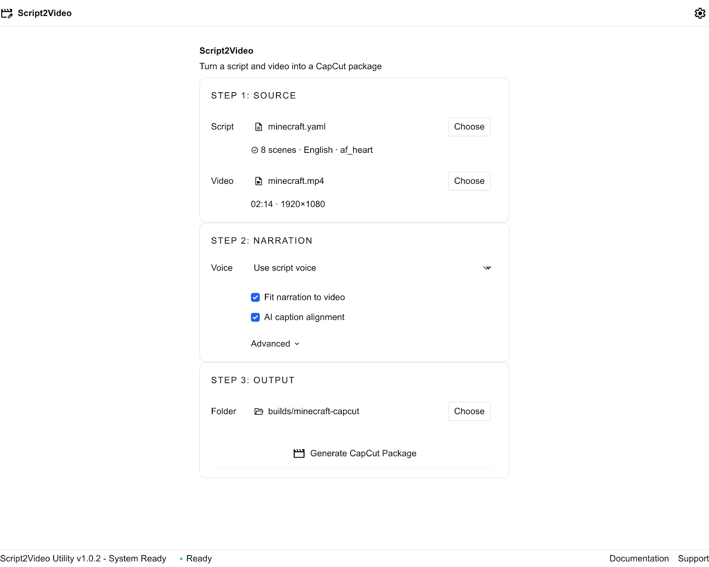

# script2video

[English](README.md) | [简体中文](README.zh-CN.md)

一套本地优先的工具，可将结构化 YAML 脚本转换为旁白、定时字幕，以及可在
CapCut 中继续编辑的素材包。

`script2video` 在你的电脑上完成语音生成和对齐。它可以逐场景渲染旁白、让
旁白时长适配现有视频，并生成标准 WAV、SRT 和 JSON 文件，无需修改 CapCut
项目文件。



## 用户安装

安装不需要 Git。请下载
[最新项目 ZIP](https://github.com/saslifat-gif/script2video/archive/refs/heads/main.zip)，
解压后，在 `script2video-main` 文件夹中打开终端。

`script2video` 目前作为本地 Python 应用运行，需要 Python 3.11 和 FFmpeg。
FFmpeg 会提供用于读取视频信息的 `ffprobe` 命令。

### macOS

安装系统依赖和应用：

```bash
brew install ffmpeg espeak-ng
python3.11 -m venv .venv
.venv/bin/python -m pip install --upgrade pip
.venv/bin/python -m pip install ".[kokoro,alignment]"
```

AI 单词级对齐需要 Apple 芯片 Mac。Intel Mac 请改为安装 `.[kokoro]`，并使用
精确字幕块计时作为回退方案。

### Windows PowerShell

使用 VS Code Remote Tunnel 时，请先确认终端属于 Windows 电脑。终端提示符应类似
`PS C:\...>`，而不是 `/Users/...` 这样的 macOS 路径。可运行以下命令确认：

```powershell
Get-Location
py -3.11 -c "import platform, sys; print(sys.executable); print(platform.platform())"
```

如果输出中出现 macOS 或 `/Users`，请先在 VS Code 中重新连接 Windows Tunnel，
再新建终端进行安装。

使用 Windows 程序包管理器安装 Python 和 FFmpeg，然后重启 PowerShell，
确保可以从 `PATH` 中找到 `ffprobe`：

```powershell
winget install --exact --id Python.Python.3.11
winget install --exact --id Gyan.FFmpeg
```

在解压后的 `script2video-main` 文件夹中安装 Windows 兼容版本：

```powershell
py -3.11 -m venv .venv
.\.venv\Scripts\python.exe -m pip install --upgrade pip
.\.venv\Scripts\python.exe -m pip install ".[kokoro]"
```

每台电脑都必须创建独立的 `.venv`。不要把 Mac 的 `.venv` 复制或同步到 Windows；
`tokenizers`、NumPy 和音频库等编译依赖包含操作系统专用文件。项目已在 Git 中
忽略 `.venv/`，因此 Git 和项目 ZIP 只会传输源代码。

MLX Whisper 无法在 Windows 上运行。桌面伴侣会自动禁用该功能，改用精确字幕块
计时。

Kokoro 通常会通过 Python 依赖提供音素支持。如果某个声音提示缺少 eSpeak
库，请从 [eSpeak NG 官方发布页](https://github.com/espeak-ng/espeak-ng/releases)
安装最新的 Windows MSI。

## 打开桌面伴侣

在 macOS 上运行：

```bash
.venv/bin/script2video companion
```

在 Windows PowerShell 中运行：

```powershell
.\.venv\Scripts\script2video.exe companion
```

桌面伴侣是完全本地的桌面窗口，不需要服务器或浏览器。

首次渲染时会从 Hugging Face 下载所选 Kokoro 模型和声音。首次启用对齐时还会
下载所选 Whisper 模型，后续运行会复用本地缓存。

## 快速开始

1. 打开桌面伴侣。
2. 在 **Script（脚本）** 中选择 `examples/minecraft.yaml` 或你自己的 YAML 文件。
3. 选择源视频和输出文件夹。
4. 选择声音，或保留 **Use script voice（使用脚本声音）**。
5. 点击 **Generate CapCut Package（生成 CapCut 素材包）**。
6. 完成后点击 **Open Output（打开输出）** 或 **Open CapCut**。

输出文件夹包含 `narration.wav`、`captions.srt`、`manifest.json`，以及各场景的
独立 WAV 文件。

如果使用命令行，可通过以下命令验证脚本并渲染旁白：

```bash
script2video validate examples/demo.yaml
script2video voices --engine kokoro
script2video render examples/demo.yaml --output builds/demo
```

为现有视频生成时长适配的旁白和字幕：

```bash
script2video capcut examples/minecraft.yaml \
  --video /path/to/video.mp4 \
  --output builds/minecraft-capcut
```

结果会写入 `builds/minecraft-capcut/`，其中包含 `narration.wav`、
`captions.srt`、`manifest.json` 和各场景的 WAV 文件。

## 功能

- 使用 [Kokoro](https://github.com/hexgrad/kokoro) 在本地生成自然语音。
- 分别渲染每个场景，并合成为一条标准化旁白。
- 根据原始脚本文本生成可编辑的 SRT 字幕。
- 在 Apple 芯片 Mac 上通过 MLX Whisper 对齐字幕和语音。
- 在安全语速范围内，让旁白时长适配视频。
- 生成包含音频、字幕和计时元数据的 CapCut 素材包。
- 提供确定性的假语音引擎，便于无模型快速开发和测试。
- 提供可保持置顶的桌面伴侣，辅助 CapCut 工作流程。

## 工作原理

```text
YAML 脚本 + 源视频
          |
          v
       生成旁白
          |
          +-- 各场景 WAV 文件
          +-- 合并后的 narration.wav
          +-- captions.srt
          +-- manifest.json
```

## 脚本格式

项目使用简洁的 YAML 文件保存设置和有序场景：

```yaml
title: Script2Video Demo
language: en-US
engine: kokoro
voice: af_heart

scenes:
  - id: intro
    text: Welcome. This script becomes locally generated narration.
    pause_after_ms: 500

  - id: explanation
    text: Each scene is rendered separately and recorded in the manifest.
    speed: 1.0
```

完整示例请查看 [`examples/demo.yaml`](examples/demo.yaml)。

## 创建 CapCut 素材包

生成与现有视频时长匹配的旁白和字幕：

```bash
script2video capcut examples/minecraft.yaml \
  --video /path/to/video.mp4 \
  --output builds/minecraft-capcut
```

输出目录结构如下：

```text
builds/minecraft-capcut/
├── narration.wav
├── captions.srt
├── manifest.json
└── scenes/
    └── 001-*.wav
```

默认情况下，该命令会：

1. 使用 `ffprobe` 测量视频时长。
2. 调整场景语速，使旁白适配视频时长。
3. 使用 MLX Whisper 将已知脚本文本与语音对齐。
4. 写出可编辑的音频、字幕和计时元数据。

为了保证旁白清晰易懂，适配器会拒绝 `0.50`–`2.00` 范围之外的语速。使用
`--no-fit` 可以保留脚本中的原始语速，使用 `--no-align` 可以改用精确字幕块
计时，使用 `--align-model base.en` 可以选择更大的英语对齐模型。

在 CapCut Desktop 中使用素材包：

1. 导入 `narration.wav`，并将其放在时间线起点。
2. 打开 **Captions → Add Captions**，以 UTF-8 格式导入 `captions.srt`。
3. 将字幕保留在时间线起点，然后应用你需要的字幕样式。

实现细节请查看 [`docs/m3-capcut.md`](docs/m3-capcut.md)。

## 桌面伴侣工作流程

置顶窗口可用于选择 YAML 脚本、源视频、输出文件夹、声音和对齐模型。它可以
生成素材包、打开输出文件夹并启动 CapCut。

桌面伴侣通过标准文件导出，而不是直接修改 CapCut 项目，因为 CapCut 没有提供
公开的桌面插件 SDK。

## 语言和声音

支持的项目语言代码包括 `en-US`、`en-GB`、`es-ES`、`fr-FR`、`hi-IN`、
`it-IT`、`ja-JP`、`pt-BR` 和 `zh-CN`。所选声音必须支持项目语言。

列出 Kokoro 提供的所有声音：

```bash
script2video voices --engine kokoro
```

## 开发

只有希望修改源代码的贡献者才需要 Git。克隆仓库并以可编辑模式安装：

```bash
git clone https://github.com/saslifat-gif/script2video.git
cd script2video
python3.11 -m venv .venv
source .venv/bin/activate
python -m pip install -e ".[dev,kokoro,alignment]"
```

在 Windows 上请使用 `.\.venv\Scripts\Activate.ps1` 激活环境，并从 extras 中
移除 `alignment`。

运行完整测试：

```bash
python -m pytest
```

如需在不下载语音模型的情况下快速测试，可将脚本中的引擎覆盖为确定性的假引擎：

```bash
script2video render examples/demo.yaml \
  --engine fake \
  --voice test_narrator \
  --output builds/demo-fake
```

假引擎会写入包含短测试音的有效 WAV 文件，因此无需托管 API 或模型下载，也可
进行端到端测试。

## 文档

- [第一阶段设计](docs/stage-1-design.md)
- [CapCut 素材包设计](docs/m3-capcut.md)

## 许可证

本项目按 [`LICENSE`](LICENSE) 中的条款授权。
